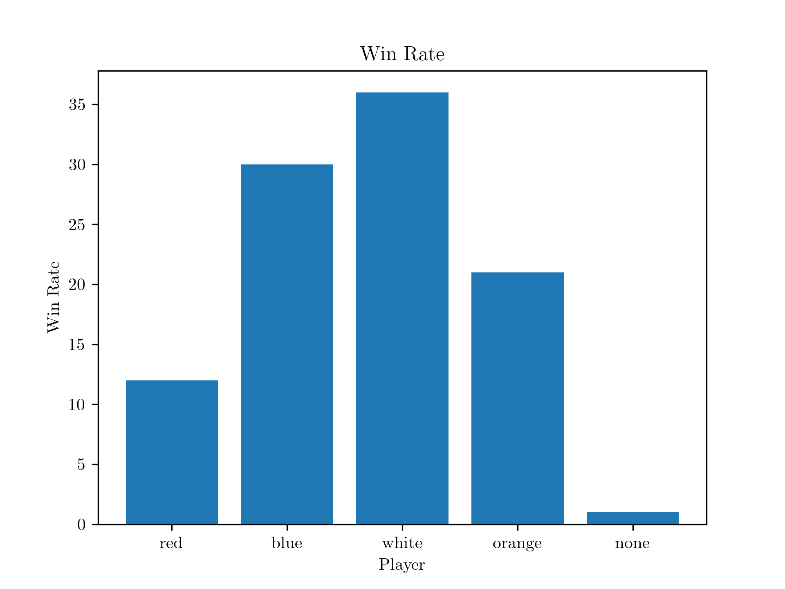
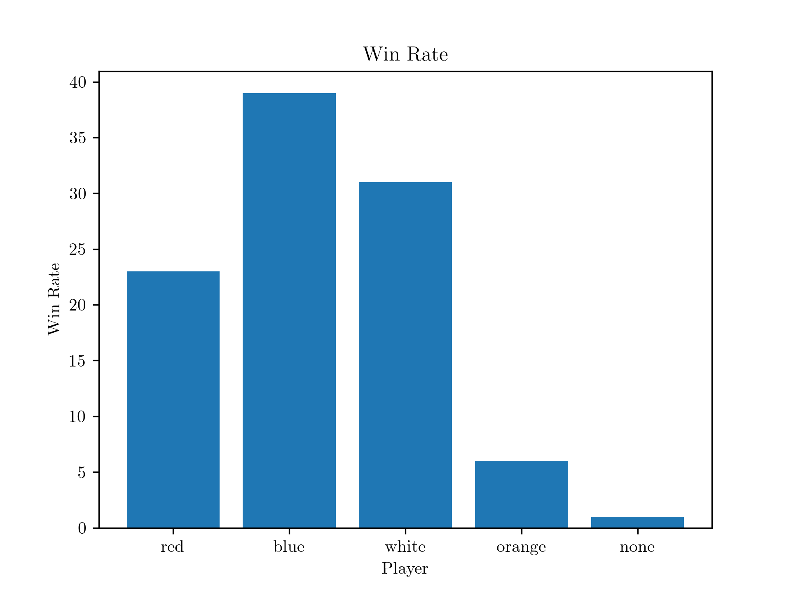

Optimizing orange

## Optuna Study Name: test

Number of trials: 1000

Evaluting at 100 games

## Optimize Orange Score Post Optimizations

Post Optimizations



Pre-optimizations



Optimization Parameters:

```
road_building_reward: 4.388701856184792
settlement_building_reward: 3.35072169547918
city_building_reward: 3.0072767282644963
development_card_reward: 1.185213666802714
settlement_building_cost: 0.06226978756986416
city_building_cost: 1.8593249111054284
development_card_cost: 0.536403847410408
road_building_cost: 0.6260303589919194
road_building_when_abundant_resources: 0.018056669534254364
development_card_reward_when_abundant_resources: 0.011364127862888575
```

Default parameters:

```
road_building_reward: 4
settlement_building_reward: 3.2
city_building_reward: 2.6
development_card_reward: 1.6
settlement_building_cost: 0.2
city_building_cost: 1.6
development_card_cost: 0.8
road_building_cost: 0.4
play_development_card_cost_bias: 0
play_development_card_reward: 2.0
road_building_when_abundant_resources: 0.1
development_card_reward_when_abundant_resources: 0.2
```
